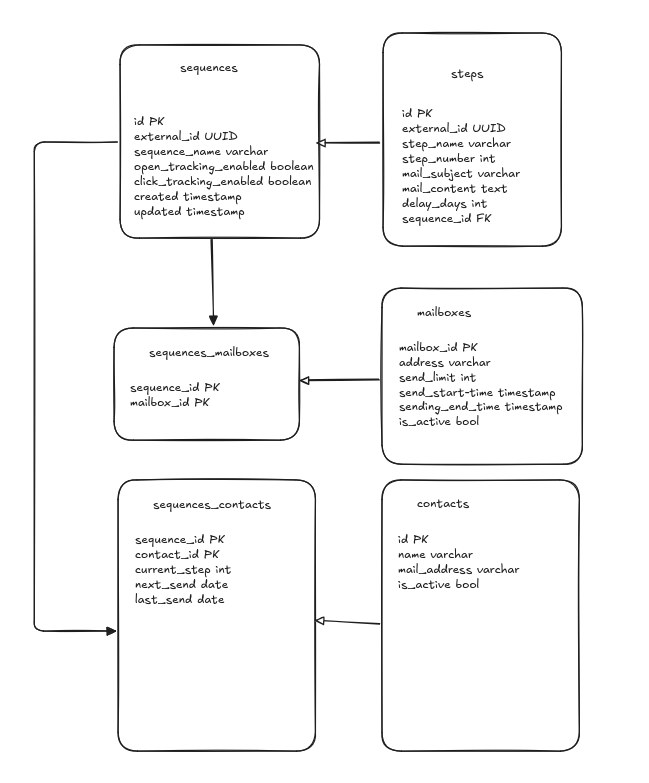
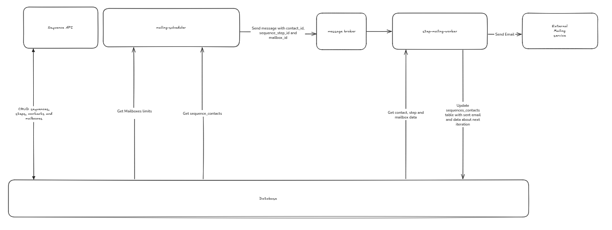

# sequence-technical-test

## Requirements

To run the images:

- Docker version 28 or greater with Docker Compose

Or to run the application locally:

- Golang 1.25+
- Postgres 17+

### Environment Variables

All environment variables are available in the `.env.example` file, you can copy them to a `.env` file to test the app locally

## Running

The recommended way to run this application is through Docker Compose.

### Using Docker Compose

```shell
docker compose up --build -d 
```

This will create a postgres container, a pgAdmin app to interact direclty with the database via web interface, a container that automatically runs all the migrations and the Sequence API

### Using Docker

To run it with just docker, you'll need to create a postgres container first:

```shell
docker run --name db -d -p 5432:5432 \
    -e POSTGRES_USER=postgres \
    -e POSTGRES_PASSWORD=postgres \
    -e POSTGRES_DB=postgres \
    postgres:17.6-alpine3.22
```

Then, create a `.env` file in the root of the project with the postgres credentials, this is required to run the migrations in the database.

After that, run the migrations:

```shell
make folder=postgres migrate
make folder=sequencemailbox migrate
```

With the migrations in place, the database is ready to serve the application.

Build and run the app's container:

```shell
docker build -t sequence-technical-test .

docker run --name sequence-technical-test -d -p 8000:8000 \
    -e APP_PORT=8000 \
    -e DB_HOST=db.local \
    -e DB_PORT=5432 \
    -e DB_USER=postgres \
    -e DB_PASSWORD=postgres \
    -e DB_NAME=postgres \
    -e DB_MAX_CONNECTIONS=10 \
    -e DB_MIN_CONNECTIONS=1 \
    -e DB_MAX_CONN_IDLE_TIME=30 \
    sequence-technical-test
```

### Using Golang Locally

This application depends on Postgres, Golang and some environment variables described at the Requirements section, so you'll need to install/set them first.

Then, build and run the sequence-technical-test app:

```shell
make clear

make build

make run-bin
```

After that, the app will be available at the specified port or, by default, port 8000.

## Endpoints

### POST /sequences

Create a sequence and returns the populated model version of it

Example body:

```json
{
    "name": "My Sequence",
    "openTrackingEnabled": false,
    "clickTrackingEnabled": true,
    "steps": [
        {
            "mailSubject": "Subject 1",
            "stepNumber": 1,
            "mailContent": "My contact"
        },{
            "mailSubject": "Subject 2",
            "stepNumber": 2,
            "mailContent": "My content 2"
        }
    ]
}
```

Response body example:

```json
{
  "id": "624f19a9-4049-4c26-81e4-603544933f8a",
  "name": "My Sequence 191",
  "openTrackingEnabled": false,
  "clickTrackingEnabled": true,
  "steps": [
    {
      "id": "b9f31219-e0df-4105-9b2d-d1ae948a9c46",
      "stepNumber": 1,
      "mailSubject": "Subject 1",
      "mailContent": "89 Sun, 31 Aug 2025 16:44:24 GMT"
    },
    {
      "id": "bfc2b5db-bb85-4eff-ba2b-5cdf1bff521b",
      "stepNumber": 1,
      "mailSubject": "Subject 65",
      "mailContent": "Lorem Ipsum"
    }
  ],
  "createdAt": "2025-08-31T16:44:24Z",
  "lastUpdatedAt": null
}
```

### GET /sequences

Get a list of sequences

Query parameters:

- size: Size of the sequences page 
- page: number of the page

Response body example:

```json
[
  {
    "id": "943ad541-ecdb-4dc0-98a2-9f5ec7926afc",
    "name": "My Sequence 734",
    "openTrackingEnabled": true,
    "clickTrackingEnabled": false,
    "steps": [
      {
        "id": "eab54265-2535-4d5e-a5ee-c7cd2a073cda",
        "stepNumber": 0,
        "mailSubject": "Subject 79",
        "mailContent": "Lorem Ipsum"
      },
      {
        "id": "62ae9531-3984-4f58-9098-e7ebaac0480a",
        "stepNumber": 0,
        "mailSubject": "Subject 70",
        "mailContent": "Lorem Ipsum"
      }
    ],
    "createdAt": "2025-08-31T16:21:09Z",
    "lastUpdatedAt": "2025-08-31T16:39:09Z"
  }
]
```

### GET /sequences/{id}

Returns the sequence with given ID, returns 404 if not found

Response body:

```json
{
  "id": "533abdc1-1798-4c6d-b11a-6477b11c5350",
  "name": "My Sequence 374",
  "openTrackingEnabled": true,
  "clickTrackingEnabled": false,
  "steps": [
    {
      "id": "7169e2dc-eb1e-48da-886d-1eb5fa83e593",
      "stepNumber": 0,
      "mailSubject": "Subject 64",
      "mailContent": "19 Sun, 31 Aug 2025 16:21:28 GMT"
    },
    {
      "id": "afa04fbe-a1a2-4935-83ed-558b0a7979f9",
      "stepNumber": 0,
      "mailSubject": "Subject 39",
      "mailContent": "Lorem Ipsum"
    }
  ],
  "createdAt": "2025-08-31T16:21:28Z",
  "lastUpdatedAt": "2025-08-31T16:31:57Z"
}
```

### PATCH /sequences/{id}

Update parts of a sequence with the given id, returns 404 if not found

Request body:

```json
{
    "openTrackingEnabled": true,
    "clickTrackingEnabled": false
}
```

Response body:

```json
{
  "id": "533abdc1-1798-4c6d-b11a-6477b11c5350",
  "name": "My Sequence 374",
  "openTrackingEnabled": true,
  "clickTrackingEnabled": false,
  "steps": [
    {
      "id": "7169e2dc-eb1e-48da-886d-1eb5fa83e593",
      "stepNumber": 0,
      "mailSubject": "Subject 64",
      "mailContent": "19 Sun, 31 Aug 2025 16:21:28 GMT"
    },
    {
      "id": "afa04fbe-a1a2-4935-83ed-558b0a7979f9",
      "stepNumber": 0,
      "mailSubject": "Subject 39",
      "mailContent": "Lorem Ipsum"
    }
  ],
  "createdAt": "2025-08-31T16:21:28Z",
  "lastUpdatedAt": "2025-08-31T16:47:50Z"
}
```

### POST /sequences/{sequence_id}/steps

Create a new step for sequence with given ID, returns 404 if not found

Request body:

```json
{
    "stepNumber": 1,
    "mailSubject": "Test subject",
    "mailContent": "TEST content"
}
```

Response body:

```json
{
  "id": "1e8126af-35dc-4ba7-9e8b-bb9b5902ba82",
  "stepNumber": 1,
  "mailSubject": "Test subject",
  "mailContent": "TEST content"
}
```

### PATCH /sequences/{sequence_id}/steps/{step_id}

Partially updates a step withing a sequence for given IDs, returns 404 if any of them is not found

Request body (all fields are optional):

```json
{
    "mailSubject": "Test subject",
    "mailContent": "Test content"
}
```

Response body:

```json
{
  "id": "1e8126af-35dc-4ba7-9e8b-bb9b5902ba82",
  "stepNumber": 1,
  "mailSubject": "ATENÇÃO VEICULO ROUBADO 46",
  "mailContent": "TESTE 01 2 3"
}
```

### DELETE /sequences/{sequence_id}/steps/{step_id}

Delete a step within a sequence Id, returns 204 always.


## Tooling

The application relies on code generation to speed up development, specifically sqlc for database model/queries, mockgen for unit test mocks and golang-migrate for migrations.

Golang-migrate and sqlc are availble through docker containers, so no need to install it locally.

### Install mockgen

Mockgen is a golang tool used to create mocks for unit testing based on application's interfaces.

It is not required to just run the application, but it is an important tool to create new unit tests.

First, make sure that your golang bin folder is in yout PATH. Then, run the install_tools command:

```shell
make install_tools
```

This will install mockgen and it should be ready to use. Check if its installed succefully with:

```shell
mockgen -version
```

## Theoretical task

To create this mailing system, the database should be update with the following tables:



- `mailboxes` and `contacts` tables will store their respective informations.
- `sequences_mailboxes` and `sequences_contacts` will act as M:M relation tables
- `sequences_contacts` will also store information about the emails sent to contacts, which step the sequence is and when will be next mailing

Having the database and with scalability in mind, I will apply the microservices architectural paradygm with a message queue to handle the jobs and the email-shooting, that way each part of the system can scale horizontally as needed, saving costs and making the platform more reliable.

The existing sequence api will need to be updated with new endpoints to CRUD the mailboxes and contacts tables.

So the services will be:

- mailing-scheduler: This is a scheduled job that will run once a day. It'll query the databale to calculate the mailbox capacities and what sending jobs will be created. This can be done through the `sequences_contacts` table, that can be joined with other tables from the sequences and mailboxes domains, specifically using the `next_send` and `last_send` fields. If the `next_send` date is less than or equal to the current date, a message will be send to a message broker to be processed by a worker.

- step-mailing-worker: This is a service that will listen to the queue that receives the jobs from the mailing-scheduler, It'll responsible to send the email, and update the `sequences_contacts` table with the data required for the next shooting: the `last_send` date, the `next_send` and the `current_step` fields based on the `steps.delay_days` and `steps.step_number`.

The flow will look like this:



So, to explain the flow:

The user will first create contacts, mailboxes and sequences.

After that he can assign one or more contacts and mailboxes to a sequence through the Sequence API, which will populate the sequences_contacts with the initial data required for the mailing-scheduler.

Then, on the next run of the mailing-scheduler, it will read the `sequences_contacts` table to get which contacts the system needs to send an email, relationing it to the `sequences` and `mailboxes` tables to get the mailbox limits and to calculate the time window.

For each row on `sequences_contacts` where the `next_send` is less than or equal to the current date, inside the capabilities of their mailboxes, a message will be send to the step-mailing-worker service containing the `contact_id`, `sequence_step_id` and `mailbox_id` and a timer.

The timer indicates when the email should be send to the user on the current day based on the `send_start_time` and `send_end_time`. The message broker is responsible for dealing with this timer and delivering the message on the right time.

Following that, the step-mailing-worker will fetch data from the database to send the email and update the `sequences_contacts` table for the current contact (populate `last_send` field), and add the information about the next run (`current_date` + `steps.delay_days`).

This will make a functional MVP for the task, but can be improved:

- A in-memory database, such as ValKey, can be added to the flow to handle mailbox limits more dynamically. With that, the scheduler will populate/reset the in-memory store with all limits of the mailboxes, then the step-mailing-worker can double-check the mailbox limit decrementing the limit on the store. If it is reaches 0, then the worker can resend the message to the queue with 24-hour timer on it.

### Technologies used

- PostgreSQL as the main database
- Amazon SQS for the message broker, since it can scale indefinitely and supports message timers nativelly 
- Any Mail delivery system 
- All services can run in a Kubernetes cluster to have native horizontal scalability and container jobs support. 